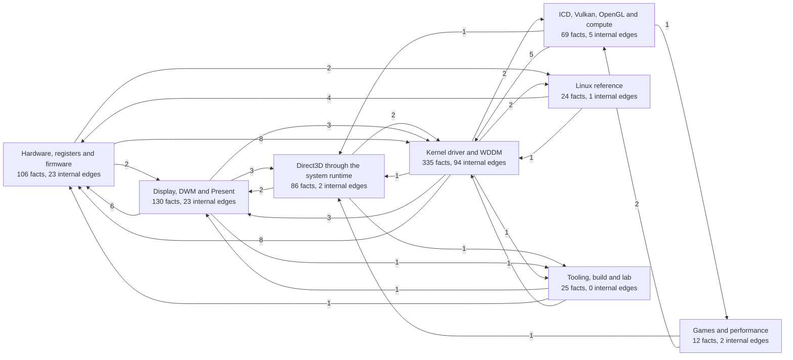

<!-- Generated by tools/facts/gen_facts.py from docs/facts/data/. Do not edit: change the YAML and run `python tools/facts/gen_facts.py --write`. -->

# Facts

The only list of established facts in this project. Rules and statuses: [`01-evidence-rules.md`](01-evidence-rules.md). Nothing is `MEASURED` or `CONFIRMED` without hardware evidence in `evidence/`.

Facts are kept as a graph in [`facts/data/`](facts/data/), one YAML file per area; this page and every page under [`facts/`](facts/) are generated from it. To add or correct a fact, edit the YAML and run `python tools/facts/gen_facts.py --write`; the quality gate runs `--check`. Format, edges and workflow: [`facts/README.md`](facts/README.md).

- A contradiction with an existing fact is resolved in place: fix the entry, say why, and add a `supersedes` or `refutes` edge from the newer fact. Never append a second version.
- IDs (`M`, measured or derived by us; `S`, read from source code; `R`, refuted prior art) are never reused or renumbered. `python tools/facts/gen_facts.py next-id` gives the next one.
- Edges marked `"auto": true` were derived from explicit wording when the table was migrated (2026-10-03); the wording is kept in `cue`.

## Areas (787 facts)

| Area | Facts | Status | Graphs |
|---|---|---|---|
| [Hardware, registers and firmware](facts/hardware.md) | 106 | 3 HYPOTHESIS, 71 MEASURED, 30 CONFIRMED, 2 REFUTED | [graphs](facts/graphs/hardware.md) |
| [Kernel driver and WDDM](facts/kmd.md) | 335 | 235 MEASURED, 99 CONFIRMED, 1 REFUTED | [graphs](facts/graphs/kmd.md) |
| [Display, DWM and Present](facts/display.md) | 130 | 126 MEASURED, 4 CONFIRMED | [graphs](facts/graphs/display.md) |
| [ICD, Vulkan, OpenGL and compute](facts/icd.md) | 69 | 65 MEASURED, 4 CONFIRMED | [graphs](facts/graphs/icd.md) |
| [Direct3D through the system runtime](facts/d3d.md) | 86 | 84 MEASURED, 2 CONFIRMED | [graphs](facts/graphs/d3d.md) |
| [Games and performance](facts/games.md) | 12 | 12 MEASURED | [graphs](facts/graphs/games.md) |
| [Linux reference](facts/linux.md) | 24 | 1 HYPOTHESIS, 20 MEASURED, 2 CONFIRMED, 1 REFUTED | [graphs](facts/graphs/linux.md) |
| [Tooling, build and lab](facts/tooling.md) | 25 | 23 MEASURED, 2 CONFIRMED | [graphs](facts/graphs/tooling.md) |

Live facts only, one line each: [`facts/current.md`](facts/current.md) (783). Every ID and its page: [`facts/ids.md`](facts/ids.md).

## Overview

Relations between areas: the number of edges from facts in one area to facts in another (edges inside an area are counted on the node).

Edges: 186 uses, 7 supports, 6 refutes, 16 supersedes; 207 of them auto-derived.
