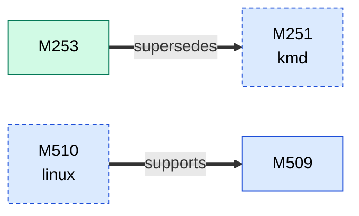
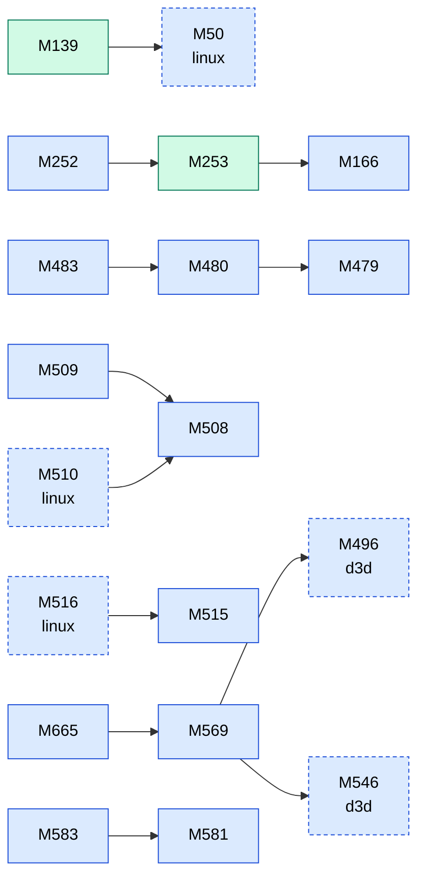

<!-- Generated by tools/facts/gen_facts.py from docs/facts/data/. Do not edit: change the YAML and run `python tools/facts/gen_facts.py --write`. -->

# Fact graphs: ICD, Vulkan, OpenGL and compute

Table: [`../icd.md`](../icd.md). Colours: status. Edge types: `supersedes`, `refutes` and `supports` are drawn thick or dashed and labelled, `uses` (one fact cites another) is a plain arrow. Facts without any relation are not drawn.

## Corrections and support

4 facts, 2 relations, in 1 graph(s) of at most 60 facts (a larger single cluster keeps its own graph). Dashed boxes belong to other areas.

## References

19 facts, 12 relations, in 1 graph(s) of at most 60 facts (a larger single cluster keeps its own graph). Dashed boxes belong to other areas.

