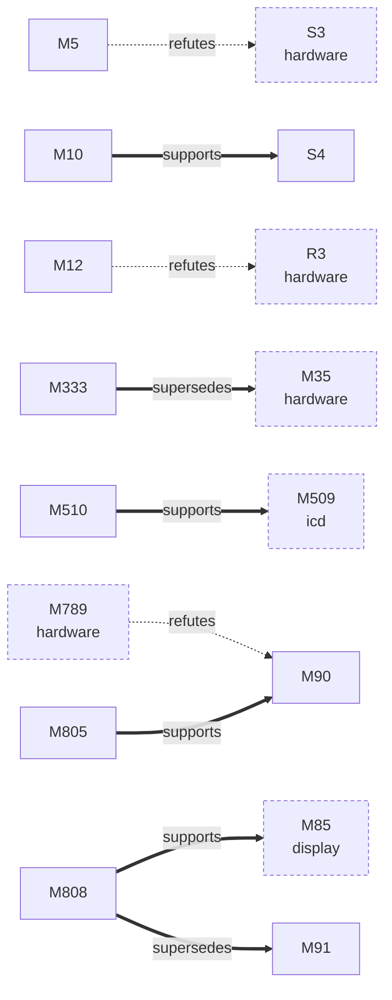
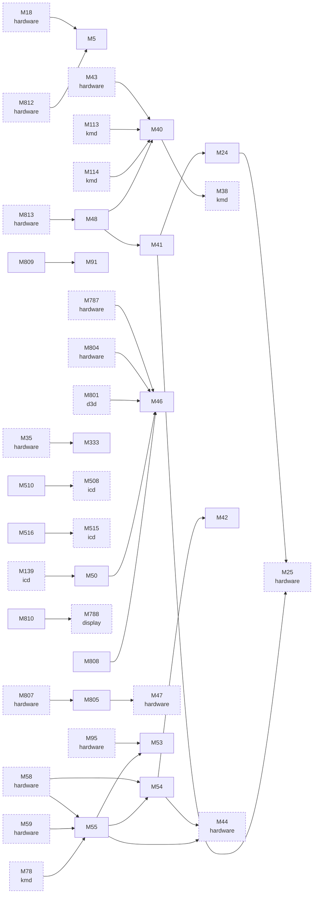

> **GENERATED by `tools/facts/gen_facts.py` from `docs/facts/data/*.yaml` - do not edit by hand.** Edit the YAML, then run `python tools/facts/gen_facts.py --write`. The gate `python tools/facts/gen_facts.py --check` (run by `tools/quality/quick.ps1` and the `facts` CI workflow) fails when this page differs from what the generator writes.

# Fact graphs: Linux reference

Table, with each fact's status: [`../linux.md`](../linux.md). Edge types: `supersedes`, `refutes` and `supports` are drawn thick or dashed and labelled, `uses` (one fact cites another) is a plain arrow. Facts without any relation are not drawn; dashed boxes belong to other areas. Connected facts are drawn in parts of at most 60 (a larger single cluster keeps its own part).

## Corrections and support

## References

